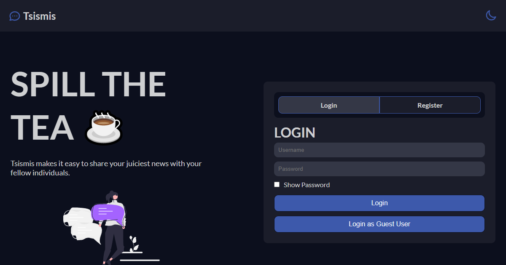

<h1 align="center"><a href='https://www.tsismis.xyz/' target='_blank' rel='noreferrer'>Tsismis</a></h1>

 A web app for sharing your juiciest news with your fellow individuals while staying anonymous. Click<a href="https://www.jeffreybernadas.tech/tsismis" target="_blank" rel='noreferrer'> here </a>to learn more.

## ⚒️ Built with the following technologies:

<ul>
    <li>React.js</li>
    <li>Styled Components</li>
    <li>Material UI</li>
    <li>Socket.IO</li>
    <li>Node.js</li>
    <li>Express.js</li>
    <li>JWT</li>
    <li>MongoDB</li>
    <li>Heroku 🚀</li>
</ul>

## ✨ Features

<ul>
    <li>Start conversation with anyone by searching their name up.</li>
    <li>Real-time chat app.</li>
        <ul>
            <li>Real-time chatting experience.</li>
            <li>Real-time notification when an unread chat is sent by the others to the user.</li>
        </ul>
    <li>Create a group chat with admin functionalities.</li>
        <ul>
            <li>Members inside the chat can rename it.</li>
            <li>Adding and removing members are only limited to the admin (Creator).</li>
            <li>Members can leave the group chat.</li>
            <li>If the admin (Creator) leaves the chat, a new admin is randomly selected.</li>
        </ul>
    <li>With theming support (Light/ Dark).</li>
    <li>Mobile Responsive.</li>
</ul>
